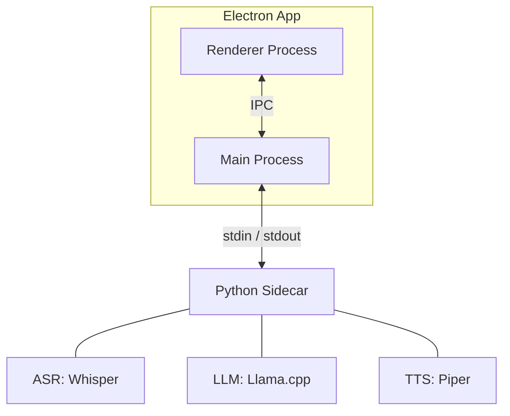

# Boilerplate Specifications: Local AI Voice Assistant

This document provides a technical blueprint for recreating a local AI voice assistant from scratch, using Electron for the shell and a Python sidecar for the AI engine.

## 1. High-Level Architecture

The application uses a **Multi-Process Sidecar Architecture**:

- **Renderer Process (React/TS)**: The UI layer. Handles user interaction and displays state.
- **Main Process (Node.js)**: The orchestrator. Manages app lifecycle, records audio, and manages the sidecar process.
- **Python Sidecar**: Separate process hosting the AI models (ASR, LLM, TTS). Communicates via `stdin`/`stdout`.



## 2. Technical Stack

### Core
- **Frontend**: Vite + React + TypeScript + TailwindCSS (optional).
- **Desktop Shell**: Electron.
- **Backend Orchestrator**: Node.js.

### AI Engine (Python 3.10+)
- **ASR**: `faster-whisper` (CTranslate2 for efficiency).
- **LLM**: `llama-cpp-python` (GGUF model support).
- **TTS**: `piper-tts` (Fast neural TTS).
- **Communication**: `JSON Lines` protocol over standard I/O.

---

## 3. Implementation Details

### A. Sidecar Lifecycle Management (Node.js)
The Main process should spawn the Python process on startup and ensure it's killed on exit.

```typescript
// src/main/sidecar.ts snippet
import { spawn, ChildProcess } from 'child_process';
import path from 'path';

let sidecar: ChildProcess;

export function startSidecar() {
  const pythonPath = process.env.NODE_ENV === 'development' 
    ? path.join(__dirname, '../../python/venv/bin/python') 
    : 'python_production_path';

  sidecar = spawn(pythonPath, [path.join(__dirname, '../../python/engine.py')]);

  sidecar.stdout?.on('data', (data) => {
    const lines = data.toString().split('\n');
    lines.forEach(line => {
      if (!line) return;
      try {
        const message = JSON.parse(line);
        // Dispatch message to Renderer
      } catch (e) {
        console.error('Failed to parse sidecar output:', line);
      }
    });
  });
}
```

### B. Python Engine Loop
The Python sidecar must run a non-blocking loop listening for commands.

```python
# python/engine.py snippet
import sys
import json
from asr import Transcriber
from llm import ChatModel
from tts import Speaker

def main():
    # Load models once
    asr = Transcriber()
    llm = ChatModel()
    tts = Speaker()

    while True:
        line = sys.stdin.readline()
        if not line: break
        
        try:
            req = json.loads(line)
            action = req.get("type")
            
            if action == "asr":
                result = asr.transcribe(req["path"])
                print(json.dumps({"type": "asr_result", "text": result}), flush=True)
            # ... handle llm and tts
        except Exception as e:
            print(json.dumps({"type": "error", "message": str(e)}), flush=True)

if __name__ == "__main__":
    main()
```

### C. Message Protocol
Standardize on JSON objects terminated by `\n`. Every response **must** include a `type` field.

| Direction | Example Message |
|-----------|-----------------|
| App -> Sidecar | `{"type": "asr", "path": "temp.wav"}` |
| Sidecar -> App | `{"type": "asr_result", "text": "Hello world"}` |

---

## 4. Frontend Design: "AI Therapist" Persona

The frontend should feel **welcoming, calm, and professional**, suitable for a therapeutic context.

### A. Aesthetics & Color Palette
- **Vibe**: Minimalist, zen, distraction-free.
- **Colors**:
    - **Primary Background**: Soft White or very light Grey (`#F8F9FA`).
    - **UI Elements / Cards**: Clean White (`#FFFFFF`) with subtle shadows.
    - **Text / Accents**: Deep Grey or Black for readability (`#212529`).
- **Typography**: Sans-serif, balanced letter spacing (e.g., Inter or Roboto).

### B. Core UI Components
- **Central Focus**: A large, circular microphone button.
    - **Idle State**: Solid outline or soft glow.
    - **Active State (Recording)**: Subtle pulse animation or color shift to indicate listening.
- **Transcript Area**: Faded text that becomes bold as new words are recognized.
- **Chat History**: Threaded layout with distinct bubble styles for User (Black text on Light Grey) and AI (White text on Deep Grey).

---

## 5. Key Performance Optimizations

1.  **Model Quantization**: Always use GGUF (for LLM) or CTranslate2 (for ASR) to reduce memory footprint.
2.  **Shared Memory / File Buffers**: Instead of piping raw audio data over `stdin` (which is slow), save audio to a temporary `.wav` file and send the file path to the sidecar.
3.  **Lazy Model Loading**: (Optional) If RAM is tight, only load the LLM after the ASR has finished. However, for a "real-time" feel, loading all models once at startup is preferred.

## 5. Deployment Considerations

- **Venv Bundling**: Use `electron-builder`'s `extraResources` to include the `python/` directory.
- **Model Downloads**: Use a post-install script or a first-run UI to download model weights, as including them in the installer will make it too large (several GBs).
